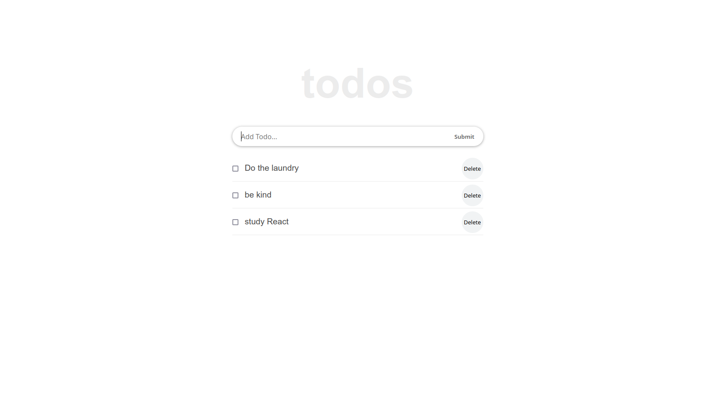

# To-Do List React App

> "To-do list" is a tool that helps to organize your day.

| Desktop version | Mobile version|
|-----------------|---------------|
|  |  | 

"To-do list" is a tool that helps to organize your day. It simply lists the things that you need to do and allows you to mark them as complete.

## Built With

- HTML5
- CSS3
- JavaScript
- Bootstrap
- React
- Linters

There is no Live Demo available at this time.

## Getting Started

To get a local copy up and running follow these simple example steps:

- Select the link with the code on the https code tab in the repo.
- Open a Terminal and write the command: 
> `git clone https://github.com/TheLuisAbarca/react_todolist`.
- Enter in the folder `react_todolist` and write the command:
> `npm install`
- After that, write the command:
> `npm start`
- You should see a live demo of the site.

## Test

- After cloning the project you need to run these commands

  > `npm install`
  > This command will download all the dependancies of the project

As this project counts with html, css and javascript, you will need to test the following:

- For tracking linter errors in HTML files run:

  > `npx hint .`

- For tracking linter errors in CSS or SASS  files run:

  > `npx stylelint "\*_/_.{css,scss}"`

- And for tracking linter errors in JavaScript files run:

  > `npx eslint .`

## Available Scripts for this project.

In the project directory, you can run:

### `npm start`

Runs the app in the development mode.\
Open [http://localhost:3000](http://localhost:3000) to view it in your browser.

The page will reload when you make changes.\
You may also see any lint errors in the console.

### `npm test`

Launches the test runner in the interactive watch mode.

### `npm run build`

Builds the app for production to the `build` folder.\
It correctly bundles React in production mode and optimizes the build for the best performance.

The build is minified and the filenames include the hashes.\
Your app is ready to be deployed!

### `npm run eject`

**Note: this is a one-way operation. Once you `eject`, you can't go back!**

If you aren't satisfied with the build tool and configuration choices, you can `eject` at any time. This command will remove the single build dependency from your project.

Instead, it will copy all the configuration files and the transitive dependencies (webpack, Babel, ESLint, etc) right into your project so you have full control over them. All of the commands except `eject` will still work, but they will point to the copied scripts so you can tweak them. At this point you're on your own.

You don't have to ever use `eject`. The curated feature set is suitable for small and middle deployments, and you shouldn't feel obligated to use this feature. However we understand that this tool wouldn't be useful if you couldn't customize it when you are ready for it.

## Authors

👤 **Luis Abarca**

- GitHub: [@TheLuisAbarca](https://github.com/TheLuisAbarca)

## 🤝 Contributing

Contributions, issues, and feature requests are welcome!

Feel free to check the [issues page](../../issues/).

## Show your support

Give a ⭐️ if you like this project!

## Acknowledgments

- Hat tip to anyone whose code was used
- Inspiration
- etc

## 📝 License

This project is [MIT](./MIT.md) licensed.